# How to treebank Demotic with Arethusa Treebanking Editor (© Perseids) – A short Introduction

By Josephine Hensel from the Digital Rosetta Stone Team

Welcome to Demotic Treebanking with Arethusa!

As part of the *Digital Rosetta Stone Project*, a tag set has been created for Demotic, particularly for the Ptolemaic period (332–30 BCE). The Demotic part of the Rosetta Stone (or “Rosettana”, London BM inv. EA 24) served as case study. The aim is to support linguistic text analysis with treebanking by using the web application *Arethusa Treebanking Editor*.

Below, we present a step-by-step instruction for treebanking Demotic texts. For general information on treebanking, please refer to the guides and tutorials linked here:

**Link 1**: <https://sites.tufts.edu/perseids/instructions/>

**Link 2**: <https://www.youtube.com/watch?v=FbRRoVnVuDs&t=70s> (morphology using Caesar’s *De Bello Gallico II* as an example)

**Link 3**: <https://www.youtube.com/watch?v=hp-bhasd96g> (syntax using Caesar’s *De Bello Gallico II* as an example)

## Step 1

Example sentence: Rosettana, Demotic version (D), line 19, § 30:

Transliteration: nꜣ md.t-pḥ.w ntj pḥ n nꜣ i͗rpy.w i͗rm nꜣ ky.w md.t-pḥ.w (n) Kmy i͗ri ⸗f smn ⸗w ḥr pꜣi⸗w gy r-ẖ.t pꜣ hp

Translation: “The honors due to (or: befitting) the temples and the other honors of Egypt: He allowed them to remain in their order according to law.”

Visit the homepage of *Perseids*: <https://sosol.perseids.org/sosol/signin> and create an account or use an existing one, such as your Google account (Fig. 1a).

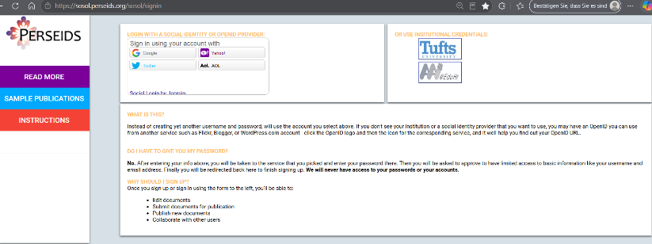
*Fig. 1a*

## Step 2

Once you have logged in, you will see your dashboard (Fig. 1b). On the menu to the left, you can adjust some personal settings ( “Account”).

In the center, you will find (later) all the files you have created, sorted by date.

There are four options in the main menu at the top:

1. New Treebank Annotation
2. New Text Alignment
3. Import Annotations
4. New Transcription

To create a treebank, choose “New Treebank Annotation.”

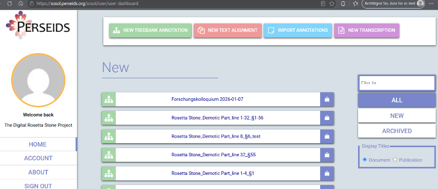
*Fig. 1b*

## Step 3

On the left part of the website, there is a field for your text. Enter the Demotic text by typing it in manually or by copying and pasting it from another resource (Fig. 2). We recommend you never insert entire texts at once – instead, proceed sentence by sentence or paragraph by paragraph. Make sure to use *Unicode input and fonts* such as New Athena Unicode. (If your texts are in betacode and typed with fonts like “Transliteration” or “Umschrift.ttf”, you can convert them easily with this web-based converter tool: <https://pnm.uni-mainz.de/tools/unicode/>.)

On the right, select the following fields:

- Language: **Demotic**
- Text Direction: **Right to Left**

Open “**Click to toggle advanced options**” and select “**Demotic**” to activate the grammar. Finally, click “**Edit**.”

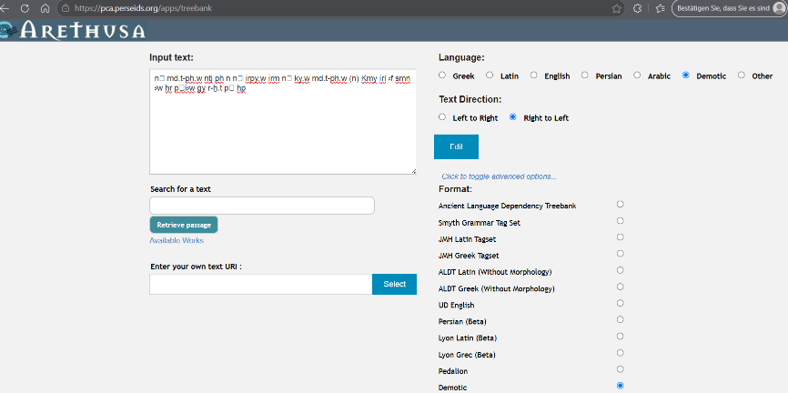
*Fig. 2*

## Step 4

After this, the *Arethusa Treebanking Editor* is opened. You will see that Arethusa has split your sentence and is not displaying it in its entirety (Fig. 3). The reason is that punctuation marks and parentheses are automatically recognized by the system as such and not as parts of words in the transliteration.

Click the arrow next to the “1” in the menu bar at the top left, next to the search field. All the other parts of the sentence are there.

It is necessary to edit the text in its corresponding XML file. Therefore, click the **Exit icon** in the top-right corner to close the Treebanking Editor.

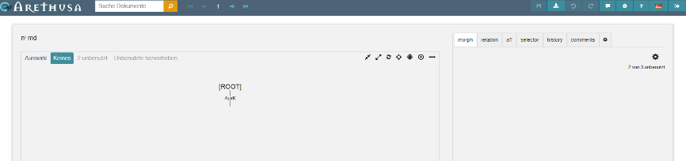
*Fig. 3*

## Step 5

The new file is on display, and under **EDIT** you will see that Arethusa has divided the sentence into eight passages (Fig. 4). Open **EDIT XML**.

You have to modify the sections `<sentence id="1" document_id="" subdoc="" span=""> ... </sentence>` ... (Fig. 5a).

This XML section must be cleaned up that, in the end, there is either a single sentence or a section containing multiple sentences, with their words nested under it using `<word id="1" form="" .../>` (Fig. 5b).

You will find the final result if you click on **EDIT** (Fig. 6).

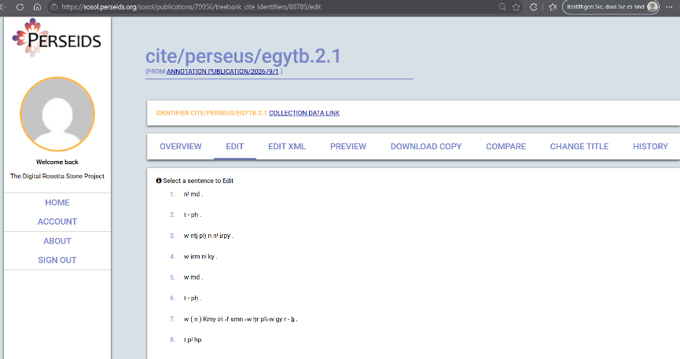
*Fig. 4*

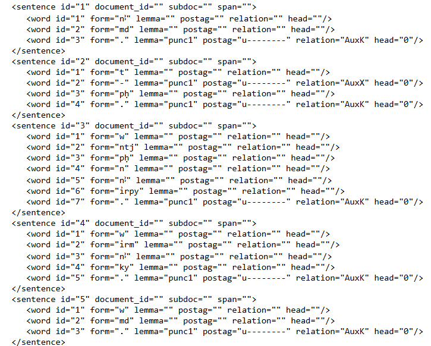
*Fig. 5a*

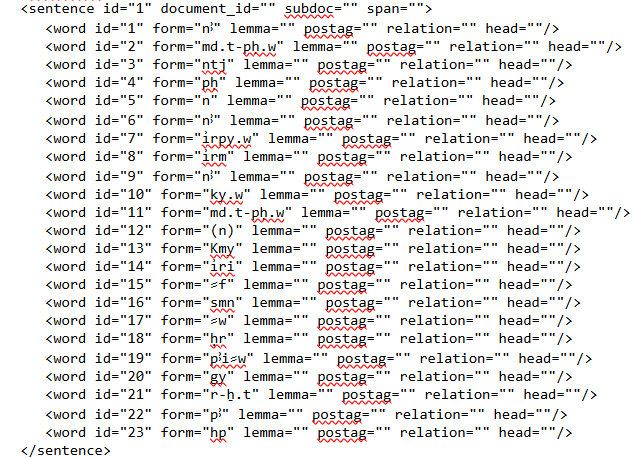
*Fig. 5b*

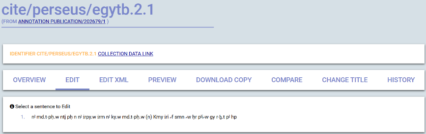
*Fig. 6*

## Step 6

Now you can start with the treebanking. Click on the sentence (Fig. 6) to open the Treebanking Editor (Fig. 7). On the user interface, the sentence is shown in the upper-left corner. Below there is a large text field labelled with **[ROOT]** in the center—the place where the syntax tree will be displayed later.

On the right, you will find a small menu bar. The fields of interest here are **morph** and **relation**.

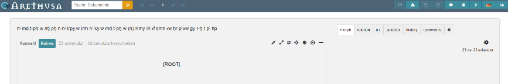
*Fig. 7*

## Side Note: User interface and icons

a) top-left (Fig. 8a; from left to right): Document Search (Arethusa); arrows for switching between sentences within a section or text.

b) top-right (Fig. 8b; from left to right): Save (*available when red*); Preview and Download; Undo and Redo (*applicable in the syntax tree; available when white*); Contact Arethusa; Settings; Help[^help]; Language; Exit.

c) Syntax tree (Fig. 8c; from left to right): Compact; Expand; Change direction; Focus on [ROOT]; Focus on selection; Center tree; Adjust the width.

*Fig. 8a*

*Fig. 8b*

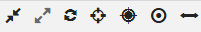
*Fig. 8c*

[^help]: Color legends and abbreviations, messages (edit history); Editor; Keyboard shortcuts; Tools; About Arethusa.

## Step 6 (*continued*)

Treebanking takes place on two levels:

1.  morphology—determining word categories

2.  syntax—assigning syntactical functions, creating the syntax tree

First, select **morph** and then click on the first word of the sentence (Fig. 9). It is now highlighted in yellow. On the right, you can manually assign various information to that word. The fields are optional:

- Lemma Translation

- Alternate gloss

- Semantic role

- Include (e.g., the subject)

- Multiword

- Notes

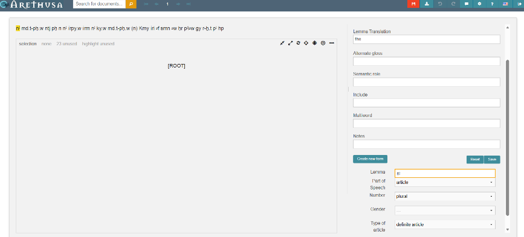
*Fig. 9*

With the button **Create new form**, you assign a word category and associated features to the selected word. To do this, choose the appropriate options from the drop-down menus that appear (Fig. 10).[^na] **Save** your selection. The word is now stored in the Treebanking Editor, automatically highlighted in a special color,[^colors] and does not need to be created again.[^spelling]

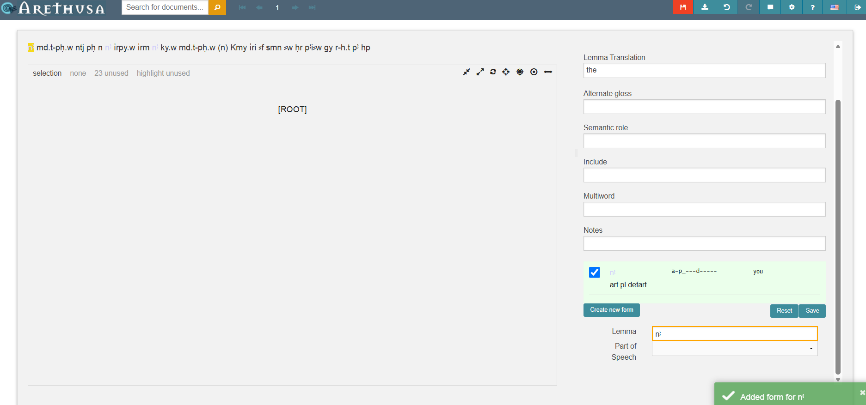
*Fig. 10*

Edit every single word in this way. Words that appear multiple times do not need to be determined again: Arethusa displays suggestions based on the saved entries.[^translation] An overview of all available word categories and their features can be found [here](Morphology tagset_final.pdf). To avoid clicking on every word, you can use the keys “w” and “e” to navigate forward and backward. Once all words have been morphologically identified, the sentence appears with multiple colors. Words that have not been identified remain black (Fig. 11).

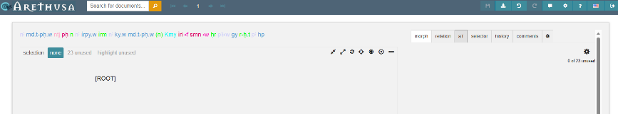
*Fig. 11*

[^na]: Note: For features that are not applicable or unnecessary, you have to select “---”.

[^colors]: You can find an overview of the colors in the main menu in the upper right corner (**?-icon**).

[^spelling]: Provided that the spelling is identical.

[^translation]: However, information such as “Translation” is not automatically transferred.

## Step 7

The next step is to determine the syntactic roles of the sentence constituents. This is the base for the actual treebanking process (see Step 8).

Switch to the **relation-**mode in the menu bar at the top right and select the first word in the sentence. On the right, click the button under the word (Fig. 12).

Select the appropriate function from the list. Some sentence constituents can be specified in more detail; these are marked with a small triangle. A list of all available relations, including explanations of the abbreviations, can be found **here [insert PDF file]**.

If a function cannot be identified, please select “---”. **Save** the changes via the main menu in the upper right corner (first icon on the left).

Now, assign a function to every single word and **save** your changes **regularly**.

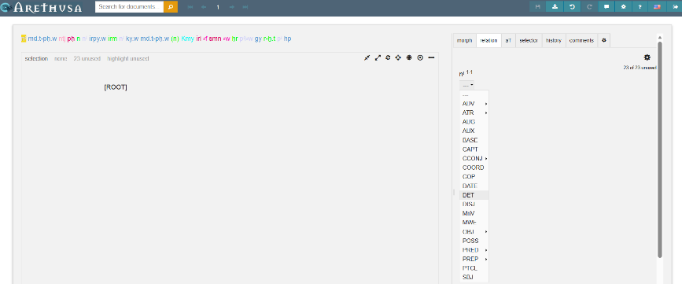
*Fig. 12*

## Step 8

Now you have identified the morphosyntactic functions of all words. To represent this graphically in a tree structure, you have to establish relationships between the sentence constituents. Arethusa does not generate syntax trees automatically; they must be constructed by yourself.

The syntax tree is created in the blank space below the sentence, labelled with **[ROOT]**.

First, some basics:

- Treebanking with Arethusa refers to the *Dependency Grammar* according to L. Tesnière.

- Assuming a *hierarchical principle*, syntactic dependencies between words are represented as follows:

1.  *Regens* = a word (e.g., a finite verb) that governs other words

2.  *Dependens* = obligatory (e.g., subject) or optional/modifying words that depend on the *regens*

Regarding the structure of the tree:

- [ROOT] = the whole sentence
- Branches and sub-branches (chains) = sentence constituent functions
- Leaves = words of the sentence

Starting mostly with a finite verb, individual sentence components are separated hierarchically. Only a single dependency between words can be represented; that is, e.g., no back-references can be established. Let’s start the treebanking:

- Identify the *regens* of a clause and select it with a click. It will be highlighted in yellow. Then click on [ROOT] and the word will be connected to it (Fig. 13–14).

- Every single *dependens* has to be selected and linked to the *regens* by clicking on it (Fig. 15). In the example, the branch “nꜣ – md.t-pḥ.w” has been created. The focus here was on the subject, which begins with the definite article. Alternatively, the branch could also be “md.t-pḥ.w – nꜣ,” with the definite article as a dependent satellite.

- Finally, the sentence and its components are visualized as an upside-down tree.

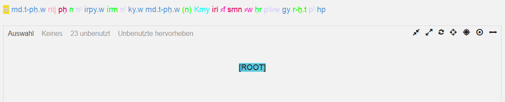
*Fig. 13*

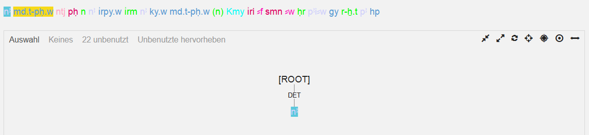
*Fig. 14*

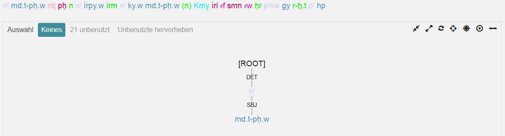
*Fig. 15*

You can see the complete syntax tree of our example Rosettana D, line 19, § 30 in Fig. 16. The chain-like sentence components typical of Demotic (and the formulaic, legal language of the decree on the Rosetta Stone) can best be visualized by flipping the tree (Fig. 17): Click on the control icon  (cf. side note, Fig. 8c) to get a horizontal view. This is a tree now with several branches and leaves!

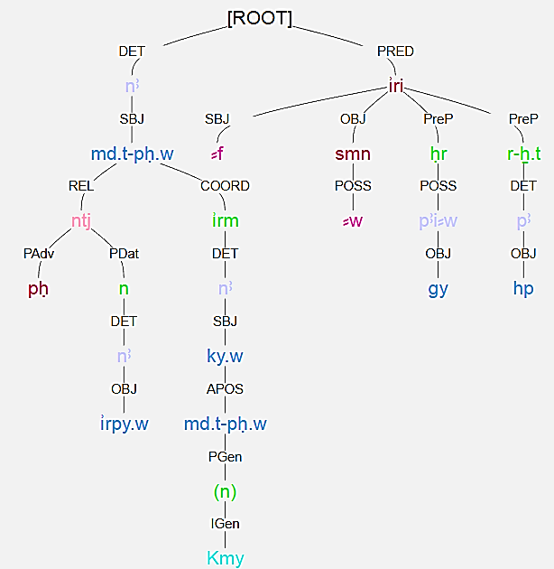
*Fig. 16*

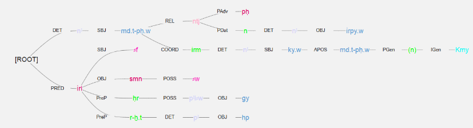
*Fig. 17*

This is how treebanking with Arethusa works for Demotic. Give it a try! And never forget to save your work. Everything could be exported into different formats.
